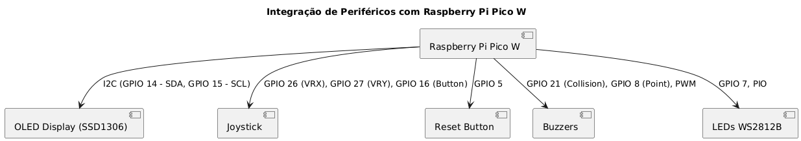
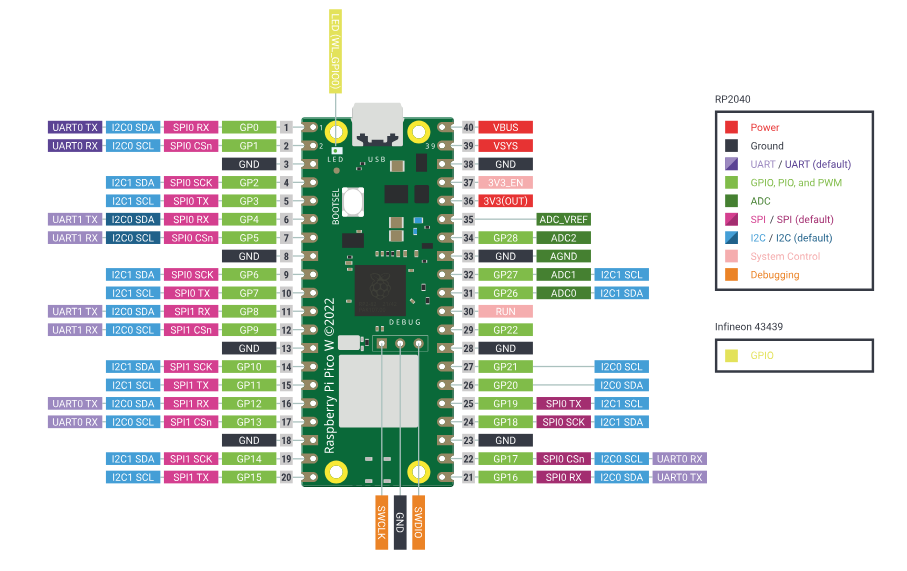
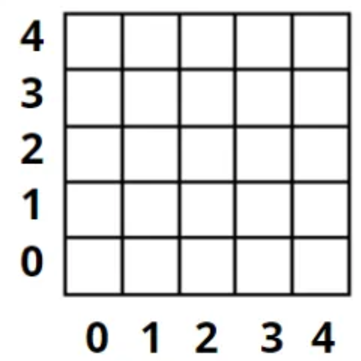
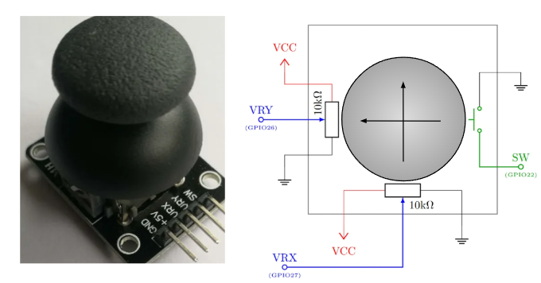
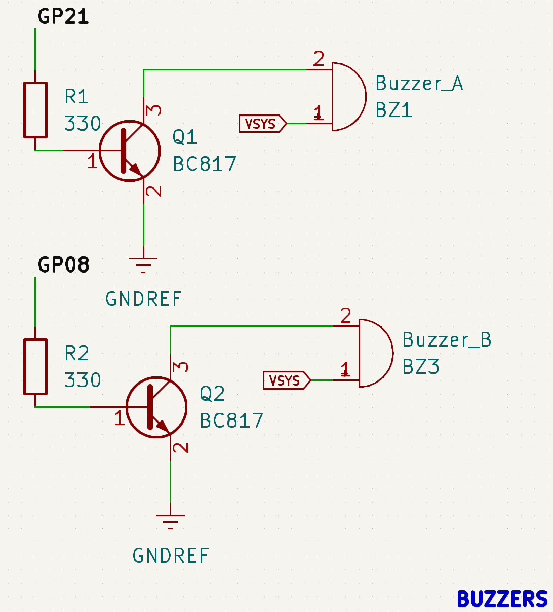

# Pong Game com Raspberry Pi Pico W

Este projeto implementa um jogo de Pong utilizando o Raspberry Pi Pico W. Ele faz uso de LEDs WS2812B para exibir a bola e as raquetes, um joystick para controle do jogador, um display OLED para mostrar o placar e buzzers para efeitos sonoros.

---

## 🕹️ Objetivo do Projeto:
Criar uma versão simplificada do clássico jogo Pong, com os seguintes recursos:
- Display do jogo em uma matriz de LEDs WS2812B.
- Controle da raquete do jogador através de um joystick analógico.
- Exibição do placar em um display OLED.
- Efeitos sonoros utilizando buzzers.

---

## 🎥 Demonstração do Jogo

Veja o jogo Pong funcionando na BitDogLab:

[Vídeo do Jogo](https://youtube.com/shorts/BFU4RABxE-4?si=h51EA3w8TT1ZtOF9)

---
## 📊 Diagrama do Projeto




Figura: Diagrama de Integração do Pong Game com Raspberry Pi Pico W

---
## 📦 Componentes Utilizados:

## Raspberry Pi Pico W

Figura: Raspberry Pi Pico W utilizado como microcontrolador principal do projeto.

---

## LEDs WS2812B


Figura: LEDs WS2812B utilizados para exibir a bola e as raquetes no jogo. São controlados via comunicação PIO.

A BitDogLab possui 25 LEDs, dispostos em 5 linhas por 5 colunas. Para orientação, vamos nomear cada LED através da sua posição (coluna versus linha) ou então (x, y) onde x indica a posição horizontal, identificando a coluna, e y, a posição vertical, identificando a linha.

#### Exemplo de Posição:

Figura: Posição dos LEDs na matriz.

Aqui, podemos identificar o LED do centro da matriz com as coordenadas (2,2).

Figura: Identificação do LED central da matriz.

#### Conexão da Matriz de LEDs:

No caso da BitDogLab, a matriz de 25 LEDs endereçáveis está conectada em série da seguinte forma.

Figura: Esquema de conexão dos LEDs.

Os números em vermelho indicam a posição dos LEDs na fila. Então, utilizaremos um vetor de 25 posições com números inteiros para identificar a posição de cada LED nesta matriz.

#### Controle de LEDs

Controlar a cor de cada LED em uma posição determinada exige precisão temporal para enviar os sinais digitais que determinam a cor e a intensidade de cada LED. O protocolo utilizado pelos LEDs WS2812 é sensível a variações de tempo na ordem de nanosegundos. Implementar esse controle diretamente via software pode ser desafiador e consumir muitos recursos do microcontrolador, como ciclos de processamento e interrupções.

Para resolver esse problema, utilizamos o PIO (Programmable Input/Output) do microcontrolador RP2040. O PIO é um recurso de hardware que permite criar máquinas de estado programáveis capazes de gerar sinais precisos de forma independente, sem sobrecarregar os núcleos principais do microcontrolador.

Com esta abordagem usando PIO, conseguimos garantir o timing necessário para o protocolo dos LEDs WS2812, liberar o processador para outras tarefas ou reduzir o consumo de energia e simplificar o envio de dados para a matriz de LEDs, tornando o sistema mais eficiente.

#### Mais Detalhes sobre o PIO

Agora que entendemos a importância do PIO para o controle preciso da matriz de LEDs, vamos detalhar o funcionamento da função npWrite. Essa função utiliza a máquina PIO para enviar os dados de cor, armazenados no buffer da matriz de LEDs, diretamente ao hardware. No entanto, como veremos, essa função apenas transmite os dados do buffer para os LEDs, e, por isso, é necessário que as cores sejam definidas previamente no buffer para que os LEDs acendam. A função npWrite organiza os dados e envia para o PIO, enquanto o PIO cuida do trabalho de baixo nível, como o timing preciso necessário para os LEDs.

A seguir, exploraremos como configurar e utilizar o PIO para controlar os LEDs endereçáveis da BitDogLab, detalhando cada etapa do processo de inicialização e operação da matriz.

#### Como Usar

1. **Configuração Inicial do PIO**: A configuração do PIO no Raspberry Pi Pico deve ser realizada para permitir a comunicação correta com a matriz de LEDs WS2812.
2. **Função npWrite**: A função npWrite transmite os dados do buffer de cores para os LEDs utilizando a máquina PIO.

#### Conclusão

A utilização do PIO para controlar a matriz de LEDs WS2812B torna o sistema mais eficiente, permitindo a geração precisa dos sinais necessários sem sobrecarregar o microcontrolador. Isso resulta em um controle de LEDs mais fluido e com menor uso de recursos do sistema.

---

## Display OLED
O Display OLED é utilizado para exibir o placar do jogo Pong. Ele é conectado ao Raspberry Pi Pico W utilizando o barramento I2C.  

---

#### 📚 Bibliotecas Necessárias:
Para utilizar o Display OLED com este projeto, é necessário incluir as seguintes bibliotecas:  

- `ssd1306.h`: Reconhece as funções principais para o controle do display.
- `ssd1306_font.h`: Fornece os desenhos dos caracteres exibidos no display.
- `ssd1306_i2c.h`: Controla a comunicação I2C com o Display OLED.
- `ssd1306_i2c.c`: Declara as funções ativas para controle do display.  

---

#### 📁 Organização das Bibliotecas:
Certifique-se de organizar as bibliotecas da seguinte maneira no projeto:
```plaintext

Diretório: \Pong

Mode                 LastWriteTime         Length Name
----                 -------------         ------ ----
d-----        13/02/2025     16:15                .vscode
d-----        13/02/2025     23:24                build
d-----        13/02/2025     16:15                docs
-a----        17/01/2025     13:36              7 .gitignore
-a----        13/02/2025     16:18           2544 CMakeLists.txt
-a----        17/01/2025     13:36           3479 lwipopts.h
-a----        13/02/2025     13:21           3238 pico_sdk_import.cmake
-a----        13/02/2025     23:23          23635 pong_game.c
-a----        14/02/2025     08:07          38482 README.md
-a----        17/01/2025     13:36            963 ws2818b.pio


```
Dentro do diretório inc, organize os arquivos da seguinte forma:

```plaintext

Diretório: Pong\inc

Mode                 LastWriteTime         Length Name
----                 -------------         ------ ----
-a----        17/01/2025     13:36           1114 ssd1306.h
-a----        17/01/2025     13:36           2183 ssd1306_font.h
-a----        17/01/2025     13:36           8424 ssd1306_i2c.c
-a----        17/01/2025     13:36           2072 ssd1306_i2c.h


```
---

## Joystick Analógico
  
Figura: Joystick analógico utilizado para controlar a raquete do jogador no eixo Y. Conectado aos ADCs do Raspberry Pi Pico W.

---

### 🎮 Como Funciona:

#### 📊 Eixos Analógicos (VRX e VRY):
- Quando o joystick está na **posição neutra**, os valores dos sinais são aproximadamente:
  - **VRX = VRY = VCC / 2**  
- Ao mover a alavanca:
  - **Para Cima:** VRY → Próximo de VCC  
  - **Para Baixo:** VRY → Próximo de GND  
  - **Para a Direita:** VRX → Próximo de VCC (não utilizado neste projeto)  
  - **Para a Esquerda:** VRX → Próximo de GND (não utilizado neste projeto)  

#### 📥 Conversão Analógico-Digital:
- O Raspberry Pi Pico W (RP2040) possui conversores Analógico-Digitais (ADC) acessíveis através dos **GPIOs 26 e 27**:  
  - **Eixo X (VRX)**: GPIO 26 → **ADC0** (não utilizado neste projeto)  
  - **Eixo Y (VRY)**: GPIO 27 → **ADC1** (utilizado para mover a raquete para cima e para baixo)  
- Os ADCs convertem os sinais analógicos em **palavras digitais** de 12 bits, variando de **0 a 4095**, que são processadas para determinar a direção do movimento.  

#### 🔄 Lógica de Movimento:
- **Para Cima:** `VRY > 4000` → Raquete sobe (desde que não esteja no topo).  
- **Para Baixo:** `VRY < 1000` → Raquete desce (desde que não esteja na parte inferior).  

---

#### 🔘 Botão do Joystick:
Além dos eixos analógicos, o joystick possui um **botão integrado** que é acionado ao pressionar a alavanca para baixo.  
- **Conexão**: O botão está conectado ao **GPIO 16** do Raspberry Pi Pico W.  
- **Configuração**:
  - O GPIO é configurado como **entrada digital** com **resistor de pull-up interno**.  
  - Isso mantém o estado padrão do pino em **HIGH (nível alto)**.  
  - Ao pressionar o botão, o pino é conectado ao **GND**, mudando o estado para **LOW (nível baixo)**.  
- **Uso no Jogo**: O botão pode ser utilizado para ações especiais no jogo (como iniciar uma partida ou pausar o jogo).

---


## Buzzers (A e B)
  
Figura: Foto do buzzer e seu esquema elétrico com as GPIOs que controlam os buzzers A e B.  
- **Buzzer A**: Utilizado para sons de colisão e efeitos gerais. Conectado ao **GPIO 21**.  
- **Buzzer B**: Utilizado para som de ponto marcado. Conectado ao **GPIO 8**.  

---

#### 🔊 Como Funciona:
Os buzzers utilizados neste projeto são do tipo **passivo**, funcionando de maneira similar a um alto-falante básico. Eles utilizam uma **bobina eletromagnética** e uma **membrana** para produzir som.  

- Quando um **sinal elétrico variável** é aplicado à bobina, ele cria um **campo magnético** que interage com um **imã** fixo.  
- Esta interação faz a bobina e, consequentemente, a membrana vibrarem.  
- As vibrações deslocam o ar ao redor, gerando **ondas acústicas** que são percebidas como som.  

---

#### 🎵 Como a Música é Produzida:
O som é uma **onda que se propaga** através de um meio (como ar, água ou sólidos). Essas ondas são criadas por vibrações que deslocam as partículas do meio ao redor.  

#### 🎚️ Características do Som:
- **Frequência (Hz)**: Determina o quão **aguda** ou **grave** é a onda sonora.  
  - Frequências mais altas → Tons mais agudos.  
  - Frequências mais baixas → Tons mais graves.  
- **Amplitude**: Determina o **volume** do som.  
  - Amplitudes maiores → Sons mais altos.  
  - Amplitudes menores → Sons mais baixos.  

---


---
## Botão de Reset

O botão de reset é utilizado para reiniciar o placar do jogo Pong. Ele é conectado ao **GPIO 5** do Raspberry Pi Pico W.

---

#### 📥 Definindo Dados de Entrada:
No Raspberry Pi Pico W (RP2040), os GPIOs podem ser configurados como entradas ou saídas digitais.  
Neste projeto, o **GPIO 5** é configurado como **entrada digital** para detectar o estado do botão de reset.

##### 🔌 Como Funciona:
- Quando configuramos um GPIO como entrada com **resistor de pull-up interno**, o estado padrão do pino será **HIGH (nível alto)**.  
- Ao pressionar o botão, o GPIO é conectado ao **GND**, mudando o estado para **LOW (nível baixo)**.  
- Esta técnica simplifica o circuito, eliminando a necessidade de resistores externos e garante que a entrada não fique flutuando, evitando leituras incorretas.  

##### 🔄 Lógica de Funcionamento:
- **Botão Solto**: GPIO 5 = **HIGH (nível alto)** → O placar permanece inalterado.  
- **Botão Pressionado**: GPIO 5 = **LOW (nível baixo)** → O placar é reiniciado para 0.  

Essa abordagem garante estabilidade na leitura do estado do botão e simplicidade na montagem do circuito.  

---


## ⚙️ Funcionalidades:

## 🎮 Jogabilidade:
- O jogador controla a raquete do lado direito usando um joystick.
- A CPU controla automaticamente a raquete do lado esquerdo.
- O objetivo é rebater a bola sem deixá-la passar pela sua raquete.

## 📊 Placar:
- O placar é exibido no display OLED no formato: `You: X  CPU: Y`
- O placar é reiniciado ao pressionar o botão de reset.

## 🎨 Efeitos Visuais:
- A bola e as raquetes são exibidas nos LEDs WS2812B:
  - **Bola**: Vermelho
  - **Raquete do Jogador**: Verde
  - **Raquete da CPU**: Azul
- Efeito de flash amarelo ao colidir com as paredes.
- Animação de explosão ao marcar ponto na CPU.

## 🔊 Efeitos Sonoros:
- **Colisão com a parede**: Beep agudo.
- **Toque na raquete do jogador**: Beep grave.
- **Toque na raquete da CPU**: Beep agudo.
- **Ponto marcado**: Som de explosão.

---

## 🔌 Ligações e Pinos:

### LEDs WS2812B:
- **Quantidade de LEDs**: 25 (organizados em matriz 5x5)
- **Pino de Dados**: GPIO 7

### Display OLED (I2C):
- **SDA**: GPIO 14
- **SCL**: GPIO 15

### Joystick:
- **Eixo X (VRX)**: ADC0 (GPIO 26)
- **Eixo Y (VRY)**: ADC1 (GPIO 27)
- **Botão do Joystick (SW)**: GPIO 16

### Buzzers:
- **Buzzer A (Colisão e Efeitos Gerais)**: GPIO 21
- **Buzzer B (Ponto Marcado)**: GPIO 8

### Botão de Reset:
- **GPIO 5**

---


## Pseudocódigo - Linguagem C

#### Inclusão de Biblioteca: Chamamos as bibliotecas padrões necessárias.

```c

#include <stdio.h>
#include <string.h>
#include "pico/stdlib.h"
#include "hardware/pio.h"
#include "hardware/adc.h"
#include "hardware/pwm.h"
#include "hardware/i2c.h"
#include "inc/ssd1306.h"

```

#### Definição de Pinos e Parâmetros:

```c

// Definição dos pinos do buzzer para efeitos sonoros
#define BUZZER_A 21 // Pino GPIO conectado ao Buzzer A (colisão com a raquete)
#define BUZZER_B 8  // Pino GPIO conectado ao Buzzer B (ponto marcado)
#define BUZZER_FREQUENCY 1000 // Frequência do som emitido pelos buzzers em Hertz


// Definição de parâmetros para os LEDs WS2812B
#define LED_COUNT 25 // Quantidade total de LEDs no strip
#define LED_PIN 7    // Pino GPIO conectado ao Data IN dos LEDs

// Definição do botão adicional
#define BUTTON_A 5   // Pino GPIO conectado ao Botão A

// Definição dos pinos do joystick
#define VRX_PIN 26  // Eixo X do joystick conectado ao ADC0
#define VRY_PIN 27  // Eixo Y do joystick conectado ao ADC1
#define SW_PIN 16   // Botão do joystick (pressionado = LOW)

```

#### Buffer para armazenar o estado de todos os LEDs
```c
Cada posição representa um LED na tira WS2812B
npLED_t leds[LED_COUNT];

```
 

#### Variáveis da máquina PIO para controle dos LEDs
 ```c
PIO np_pio;  // Instância da PIO utilizada para comunicação com os LEDs
uint sm;     // State machine da PIO para enviar dados aos LEDs

```


#### Variáveis para a posição da bola no jogo
```c
int ballX = 2, ballY = 2; // Posição inicial da bola
int ballDirX = 1, ballDirY = 1; // Direção de movimento da bola

```


#### Variável para a posição da raquete do jogador
 ```c
int paddleY = 2; // Posição inicial da raquete

```


#### Variáveis para o placar do jogo
```c
int playerScore = 0; // Pontuação do jogador
int cpuScore = 0;    // Pontuação da CPU (adversário)

```
#### Função para inicializar a comunicação com os LEDs WS2812B
```c
void npInit(uint pin) {
  // Carrega o programa PIO para controle dos LEDs e retorna o offset na memória da PIO
  uint offset = pio_add_program(pio0, &ws2818b_program);

  // Define que a PIO0 será usada inicialmente
  np_pio = pio0;

  // Tenta reivindicar uma State Machine (SM) não utilizada na PIO0
  sm = pio_claim_unused_sm(np_pio, false);

  // Se não houver SM disponível na PIO0, tenta na PIO1
  if (sm < 0) {
    np_pio = pio1;
    sm = pio_claim_unused_sm(np_pio, true);
  }

  // Inicializa o programa PIO para controlar os LEDs WS2812B
  // np_pio: Instância da PIO em uso
  // sm: State Machine utilizada para comunicação
  // offset: Localização do programa na memória PIO
  // pin: Pino GPIO conectado aos LEDs
  // 800000.f: Frequência de 800kHz para comunicação com os WS2812B
  ws2818b_program_init(np_pio, sm, offset, pin, 800000.f);

  // Inicializa o buffer de LEDs, apagando todos (cor preta)
  for (uint i = 0; i < LED_COUNT; ++i) {
    leds[i].R = leds[i].G = leds[i].B = 0; // Define as cores como 0 (apagado)
  }
}

```


#### Função para definir a cor de um LED específico
index: Índice do LED na tira (0 a LED_COUNT-1)
r, g, b: Valores de cor (0 a 255) para Vermelho, Verde e Azul

 ```c
void npSetLED(const uint index, const uint8_t r, const uint8_t g, const uint8_t b) {
  leds[index].R = r; // Define a intensidade do Vermelho
  leds[index].G = g; // Define a intensidade do Verde
  leds[index].B = b; // Define a intensidade do Azul
}

```


#### Função para apagar todos os LEDs
```c
void npClear() {
  // Percorre todos os LEDs e define a cor como preta (apagado)
  for (uint i = 0; i < LED_COUNT; ++i)
    npSetLED(i, 0, 0, 0); // Define R, G e B como 0
}

```


#### Função para enviar os dados dos LEDs para a tira WS2812B

```c

void npWrite() {
  // Percorre todos os LEDs no buffer e envia os dados na ordem GRB
  for (uint i = 0; i < LED_COUNT; ++i) {
    // Envia a cor Verde primeiro (formato GRB)
    pio_sm_put_blocking(np_pio, sm, leds[i].G);

    // Em seguida, envia a cor Vermelha
    pio_sm_put_blocking(np_pio, sm, leds[i].R);

    // Por último, envia a cor Azul
    pio_sm_put_blocking(np_pio, sm, leds[i].B);
  }

  // Aguarda um tempo mínimo para garantir que os dados foram recebidos
  sleep_us(100); // 100 microsegundos de espera
}

```

#### Função para converter coordenadas 2D em índice linear na tira de LEDs
x: Coordenada X (coluna) na matriz de LEDs
y: Coordenada Y (linha) na matriz de LEDs
```c
int getIndex(int x, int y) {
  // Se a linha for par, os LEDs são organizados da direita para a esquerda
  if (y % 2 == 0) {
    // Calcula o índice para linhas pares (ordem normal)
    // 24 - (posição linear) para ajustar à ordem inversa da matriz
    return 24 - (y * 5 + x);
  } 
  // Se a linha for ímpar, os LEDs são organizados da esquerda para a direita
  else {
    // Calcula o índice para linhas ímpares (ordem reversa)
    // 4 - x inverte a ordem dos LEDs na linha
    return 24 - (y * 5 + (4 - x));
  }
}
```


#### Explicação:
- A matriz de LEDs é organizada em um padrão "zigue-zague" (snaked).
- Para linhas pares, os LEDs são dispostos da direita para a esquerda.
- Para linhas ímpares, são dispostos da esquerda para a direita.
- A fórmula ajusta a ordem para refletir isso, garantindo que as coordenadas 2D
  sejam corretamente convertidas para o índice linear do array.


#### Função para inicializar o joystick
```c
void joystickInit() {
  adc_init(); // Inicializa o ADC (Conversor Analógico-Digital)

  // Configura o pino para o eixo X do joystick como entrada analógica
  adc_gpio_init(VRX_PIN);

  // Configura o pino para o eixo Y do joystick como entrada analógica
  adc_gpio_init(VRY_PIN);

  // Inicializa o pino do botão do joystick como entrada digital
  gpio_init(SW_PIN);
  gpio_set_dir(SW_PIN, GPIO_IN);

  // Habilita o pull-up interno para o botão do joystick
  // Isso mantém o estado HIGH quando o botão não está pressionado
  gpio_pull_up(SW_PIN); 
}
```

#### Explicação:
- O joystick utiliza dois potenciômetros (eixo X e Y) conectados aos ADCs.
- O botão do joystick é um simples botão de pressão conectado a um pino digital.
- O pull-up interno garante que o pino fique em estado HIGH quando o botão está solto.


#### Função para ler o estado do joystick e atualizar a posição da raquete
```c
void readJoystick() {
  adc_select_input(0); // Seleciona o canal ADC0 (eixo Y do joystick)
  uint16_t yValue = adc_read(); // Lê o valor analógico do eixo Y
  
  // Verifica o movimento para cima
  // Se o valor for maior que 4000 e a raquete não estiver no topo
  if (yValue > 4000 && paddleY > 0) paddleY--; // Move a raquete para cima

  // Verifica o movimento para baixo
  // Se o valor for menor que 1000 e a raquete não estiver na parte inferior
  if (yValue < 1000 && paddleY < 4) paddleY++; // Move a raquete para baixo
}
```

#### Explicação:
- O eixo Y do joystick varia de 0 a 4095, sendo o centro aproximadamente 2048.
- Se o valor estiver acima de 4000, o joystick está inclinado para cima.
- Se estiver abaixo de 1000, está inclinado para baixo.
- A raquete é movida apenas se não estiver na borda superior ou inferior.


#### Função para criar um efeito de flash na parede (colisão da bola)
```c
void flashWall(int x, int y) {
  // Converte as coordenadas x, y para o índice na tira de LEDs
  int pos = getIndex(x, y);

  // Executa o flash 3 vezes para criar um efeito de piscada
  for (int i = 0; i < 3; i++) {
    // Define o LED na posição 'pos' com a cor Amarela (255, 255, 0)
    npSetLED(pos, 255, 255, 0);
    npWrite(); // Atualiza a tira de LEDs
    sleep_ms(50); // Pausa de 50 ms para manter o LED aceso

    // Apaga o LED para criar o efeito de piscada
    npSetLED(pos, 0, 0, 0); // Define a cor como preta (apagado)
    npWrite(); // Atualiza a tira de LEDs
    sleep_ms(50); // Pausa de 50 ms antes de acender novamente
  }
}
```

#### Explicação:
- Quando a bola colide com a parede, um efeito de piscada amarela é exibido.
- O LED correspondente pisca 3 vezes rapidamente para indicar a colisão.
- A cor amarela é obtida configurando os componentes Vermelho e Verde para 255.


#### Função para emitir um beep usando PWM (Pulse Width Modulation)
 pin: Pino GPIO conectado ao buzzer
 duration_ms: Duração do beep em milissegundos
```c

void beep(uint pin, uint duration_ms) {
    // Obtém o número do slice PWM associado ao pino do buzzer
    uint slice_num = pwm_gpio_to_slice_num(pin);

    // Define o nível do PWM para 50% do ciclo de trabalho
    // Valor 2048 de um total de 4096 (12 bits) para gerar som
    pwm_set_gpio_level(pin, 2048);

    // Mantém o som ativo pela duração especificada
    sleep_ms(duration_ms);

    // Desliga o som configurando o nível do PWM para 0
    pwm_set_gpio_level(pin, 0);

    // Pausa para evitar que os sons fiquem muito próximos
    sleep_ms(100);
}
```

#### Explicação:
- A função usa PWM para controlar o buzzer piezoelétrico.
- pwm_set_gpio_level() define o nível do PWM para gerar som.
- Um ciclo de trabalho de 50% (2048 em 4096) cria um tom audível.
- O som é desligado configurando o nível do PWM para 0.


#### Função para animar uma explosão nos LEDs e tocar um som correspondente
buzzerPin: Pino GPIO do buzzer usado para o som da explosão
```c
void explodeAnimation(uint buzzerPin) {
  // Executa a animação 5 vezes para criar um efeito de explosão
  for (int i = 0; i < 5; i++) {
    // Percorre as 5 posições na coluna mais à direita
    for (int y = 0; y < 5; y++) {
      // Obtém o índice do LED na coluna 4 (última coluna)
      int pos = getIndex(4, y);

      // Define a cor do LED como Vermelho (explosão)
      npSetLED(pos, 255, 0, 0);
    }

    // Atualiza a tira de LEDs para mostrar a explosão
    npWrite();

    // Emite um som de explosão com duração maior para dar impacto
    beep(buzzerPin, 200);

    // Pausa antes de apagar os LEDs
    sleep_ms(100);

    // Apaga todos os LEDs para criar o efeito de piscada
    npClear();
    npWrite();

    // Pausa curta para o próximo ciclo de piscada
    sleep_ms(50);
  }
}
```

#### Explicação:
- A animação ilumina toda a coluna mais à direita em vermelho.
- Cada ciclo consiste em acender os LEDs, emitir um som e apagar rapidamente.
- A repetição cria um efeito de "explosão" com piscadas e som impactante.
- O som é sincronizado com a iluminação para aumentar o efeito visual.


#### Função para inicializar o buzzer usando PWM
 pin: Pino GPIO conectado ao buzzer
 ```c
void pwm_init_buzzer(uint pin) {
    // Configura o pino como saída de PWM
    gpio_set_function(pin, GPIO_FUNC_PWM);

    // Obtém o número do slice PWM associado ao pino do buzzer
    uint slice_num = pwm_gpio_to_slice_num(pin);

    // Obtém a configuração padrão do PWM
    pwm_config config = pwm_get_default_config();

    // Define a divisão de clock para o PWM do buzzer
    // Calcula o divisor usando a frequência do sistema e a frequência do buzzer
    pwm_config_set_clkdiv(&config, clock_get_hz(clk_sys) / (BUZZER_FREQUENCY * 4096));

    // Inicializa o PWM com a configuração ajustada e inicia o sinal PWM
    pwm_init(slice_num, &config, true);

    // Define o nível inicial do PWM para 0 (silencioso)
    pwm_set_gpio_level(pin, 0);
}
```

### Explicação:
- A função inicializa o PWM no pino especificado para controlar o buzzer.
- Configura o divisor de clock para obter a frequência do som desejada.
- O ciclo de trabalho é inicialmente definido como 0 para não emitir som.
- A frequência é definida usando BUZZER_FREQUENCY, configurada no começo do código.


#### Flag para verificar se a bola tocou na raquete do jogador
 Usada para evitar múltiplos registros de colisão em um único toque
```c
bool touchedPaddle = false; 
```
#### Posição inicial da raquete da CPU (coluna da esquerda)
```c
int cpuPaddleY = 2;  
```

#### Flag para verificar se a bola tocou na raquete da CPU
 Usada para evitar múltiplos registros de colisão na raquete da CPU
```c
bool touchedCpuPaddle = false;  
```

#### Velocidade de movimento da raquete da CPU
 Valores mais altos tornam a CPU mais rápida
 ```c
int cpuPaddleSpeed = 2; // 1: mais lento, 2: normal
```
#### Variável para "travar" a CPU quando a bola tocar a parede esquerda
 Impede que a CPU continue se movendo enquanto a bola não retorna
 ```c
bool cpuLocked = false; 
```

#### Função para configurar o botão de reset
 Usado para reiniciar o placar do jogo
 ```c
void setupButton() {
    gpio_init(BUTTON_A);           // Inicializa o pino do botão como GPIO
    gpio_set_dir(BUTTON_A, GPIO_IN); // Define como entrada (input)
    gpio_pull_up(BUTTON_A);        // Habilita o pull-up interno para manter o estado HIGH quando não pressionado
}
```

#### Explicação:
- O botão é configurado como entrada digital.
- O pull-up interno faz com que o estado padrão seja HIGH (1).
- Quando pressionado, o estado é LOW (0), permitindo detectar a pressão.
- Isso evita interferências e leituras incorretas no botão.


#### Função para verificar o estado do botão de reset
 Se pressionado, reinicia o placar para 0
 ```c
void checkResetButton() {
    // Verifica se o botão está pressionado (estado LOW)
    if (gpio_get(BUTTON_A) == 0) { 
        playerScore = 0; // Reinicia o placar do jogador
        cpuScore = 0;    // Reinicia o placar da CPU
    }
}
```

#### Explicação:
- Quando o botão é pressionado, o estado é LOW devido ao pull-up.
- Ao detectar o estado LOW, o placar é reiniciado.
- Isso permite que o jogador reinicie a partida sem reiniciar o sistema.


#### Função para emitir um beep personalizado usando PWM
 pin: Pino do buzzer
 freq: Frequência do som em Hertz (Hz)
 duration_ms: Duração do som em milissegundos
 ```c
void beep_custom(uint pin, uint freq, uint duration_ms) {
    // Obtém o número do slice PWM para o pino do buzzer
    uint slice_num = pwm_gpio_to_slice_num(pin);

    // Obtém a configuração padrão do PWM
    pwm_config config = pwm_get_default_config();

    // Define o divisor de clock para o PWM usando a frequência desejada
    pwm_config_set_clkdiv(&config, clock_get_hz(clk_sys) / (freq * 4096));

    // Inicializa o PWM no slice correspondente ao pino, com a configuração definida
    pwm_init(slice_num, &config, true);

    // Define o ciclo de trabalho do PWM para 50% (2048 em 4096) para gerar som
    pwm_set_gpio_level(pin, 2048);

    // Mantém o som ativo pelo tempo especificado
    sleep_ms(duration_ms);

    // Desliga o som definindo o ciclo de trabalho para 0
    pwm_set_gpio_level(pin, 0);
}
```

#### Explicação:
- A função permite customizar a frequência e a duração do som do buzzer.
- A frequência do som é ajustada pela divisão do clock do sistema.
- Um ciclo de trabalho de 50% gera um tom audível.
- O som é desligado configurando o ciclo de trabalho para 0.
- Essa função é útil para gerar diferentes efeitos sonoros no jogo.


#### Função para atualizar a posição da bola e a lógica do jogo
 buzzerPin: Pino do buzzer usado para efeitos sonoros
 ```c
void updateBall(uint buzzerPin) {
    checkResetButton(); // Verifica se o botão de reset foi pressionado

    // Atualiza a posição da bola conforme a direção atual
    ballX += ballDirX;
    ballY += ballDirY;
    
    // Verifica colisão com as paredes superior e inferior
    if (ballY <= 0 || ballY >= 4) {
        ballDirY *= -1; // Inverte a direção vertical da bola
        flashWall(ballX, ballY); // Efeito de flash na parede atingida
        beep_custom(BUZZER_A, 1200, 100); // Som de colisão com a parede
    }

    // Verifica se a bola está na coluna 0 (lado esquerdo)
    if (ballX == 0) {
        cpuLocked = true; // Travar a raquete da CPU
    } else {
        cpuLocked = false;
    }

    // Movimentação da raquete da CPU (apenas se não estiver travada)
    if (!cpuLocked) {
        // Se a bola estiver acima da raquete da CPU, mover para cima
        if (ballY < cpuPaddleY && cpuPaddleY > 0) {
            cpuPaddleY -= cpuPaddleSpeed;
        }
        // Se a bola estiver abaixo da raquete da CPU, mover para baixo
        if (ballY > cpuPaddleY && cpuPaddleY < 4) {
            cpuPaddleY += cpuPaddleSpeed;
        }
    }

    // Verifica colisão da bola com a raquete do jogador
    if (ballX == 3 && ballY == paddleY) {
        ballDirX *= -1; // Inverte a direção horizontal da bola
        touchedPaddle = true;  // Marca colisão com a raquete do jogador
        touchedCpuPaddle = false;
        beep_custom(BUZZER_A, 800, 100); // Som grave ao tocar na raquete do jogador
    }

    // Verifica colisão da bola com a raquete da CPU
    if (ballX == 0 && ballY == cpuPaddleY) {
        ballDirX *= -1; // Inverte a direção horizontal da bola
        touchedCpuPaddle = true; // Marca colisão com a raquete da CPU
        beep_custom(BUZZER_A, 1500, 100); // Som agudo ao tocar na raquete da CPU
    }

    // Verifica se a bola passou pela raquete do jogador (ponto para a CPU)
    if (ballX > 4) {
        if (touchedCpuPaddle) {
            explodeAnimation(buzzerPin); // Animação de explosão na tela
            beep_custom(BUZZER_B, 400, 500); // Som de explosão
            cpuScore++; // Incrementa o placar da CPU
        }
        // Reinicia a posição e a direção da bola
        ballX = 2;
        ballY = 2;
        ballDirX = -1;
        touchedPaddle = false;
        touchedCpuPaddle = false;
    }

    // Verifica se a bola passou pela raquete da CPU (ponto para o jogador)
    if (ballX < 0) {
        if (touchedPaddle) {
            playerScore++; // Incrementa o placar do jogador
        }
        ballDirX *= -1; // Inverte a direção horizontal
        touchedPaddle = false;
        touchedCpuPaddle = false;
        beep_custom(BUZZER_B, 500, 500); // Som ao perder ponto
    }

    // Limita o placar a no máximo 99 pontos
    if (playerScore > 99) playerScore = 99;
    if (cpuScore > 99) cpuScore = 99;
}
```

#### Explicação:
- A função controla toda a lógica de movimento da bola e colisões.
- Verifica colisões com paredes, raquetes e marca pontos.
- Usa sons personalizados para indicar eventos (colisão, ponto, explosão).
- Inclui uma animação especial ao marcar ponto na CPU.


#### Função para desenhar os elementos do jogo nos LEDs
```c
void drawGame() {
    npClear(); // Limpa todos os LEDs antes de redesenhar
    
    // Desenha a bola na posição atual
    int ballPos = getIndex(ballX, ballY); // Obtém o índice do LED para a posição da bola
    npSetLED(ballPos, 255, 0, 0); // Define a cor da bola como Vermelho
    
    // Desenha a raquete do jogador na coluna direita (x = 4)
    int paddlePos = getIndex(4, paddleY);
    npSetLED(paddlePos, 0, 255, 0); // Define a cor da raquete do jogador como Verde

    // Desenha a raquete da CPU na coluna esquerda (x = 0)
    int cpuPaddlePos = getIndex(0, cpuPaddleY); 
    npSetLED(cpuPaddlePos, 0, 0, 255); // Define a cor da raquete da CPU como Azul
    
    npWrite(); // Atualiza os LEDs com as novas cores
}
```

#### Explicação:
- A função desenha todos os elementos visuais do jogo:
  - Bola (vermelho)
  - Raquete do jogador (verde)
  - Raquete da CPU (azul)
- Usa a função getIndex() para calcular o índice correto do LED, 
  levando em consideração o formato de zigue-zague dos LEDs WS2812B.
- Atualiza os LEDs para mostrar o estado atual do jogo.


#### Função para exibir o placar no display OLED
 ssd: Buffer do display
 frame_area: Área de renderização do display
 ```c
void display_score(uint8_t *ssd, struct render_area *frame_area) {
    // Limpa o buffer completamente para evitar resíduos de frames anteriores
    memset(ssd, 0, ssd1306_buffer_length);  
    
    // Buffer de texto para exibir o placar
    char scoreText[25];  // Tamanho suficiente para evitar overflow
    
    // Formata o texto do placar no formato: "You: X  CPU: Y"
    snprintf(scoreText, sizeof(scoreText), "You: %d  CPU: %d", playerScore, cpuScore);

    // Desenha o texto no display na posição (0,0)
    ssd1306_draw_string(ssd, 0, 0, scoreText);  
    
    // Atualiza o display OLED com o novo texto do placar
    render_on_display(ssd, frame_area);  
}
```

#### Explicação:
- A função display_score() é responsável por mostrar o placar do jogador e da CPU no display OLED.
- Limpa o buffer do display antes de desenhar o novo placar.
- Usa snprintf() para evitar problemas de buffer overflow ao formatar o texto.
- Desenha o texto na posição (0,0) para melhor visibilidade no display.
- Usa render_on_display() para atualizar o display com o conteúdo do buffer.


#### Função principal do jogo
```c
int main() {
    stdio_init_all();  // Inicializa a comunicação padrão de entrada/saída

    // Inicializa o PWM nos pinos dos buzzers para efeitos sonoros
    pwm_init_buzzer(BUZZER_A);
    pwm_init_buzzer(BUZZER_B);
  
    // Inicializa o I2C para o display OLED
    i2c_init(i2c1, ssd1306_i2c_clock * 1000);
    gpio_set_function(I2C_SDA, GPIO_FUNC_I2C);
    gpio_set_function(I2C_SCL, GPIO_FUNC_I2C);
    gpio_pull_up(I2C_SDA);  // Ativa o pull-up no pino SDA
    gpio_pull_up(I2C_SCL);  // Ativa o pull-up no pino SCL
    ssd1306_init();  // Inicializa o display OLED

    // Configura a área de renderização do display OLED
    struct render_area frame_area = {0, ssd1306_width - 1, 0, ssd1306_n_pages - 1};
    calculate_render_area_buffer_length(&frame_area);
    uint8_t ssd[ssd1306_buffer_length];  // Buffer para armazenar os dados do display

    // Inicializa os LEDs WS2812B
    npInit(LED_PIN);

    // Inicializa o joystick para controle da raquete do jogador
    joystickInit();
    
    // Configura o botão de reset do placar
    setupButton();

    // Define qual buzzer será usado para os sons do jogo
    uint buzzerPin = BUZZER_A;  // Pode alterar para BUZZER_B, conforme necessidade

    // Loop principal do jogo (executa continuamente)
    while (true) {
        readJoystick();  // Lê a posição do joystick para controlar a raquete do jogador
        updateBall(buzzerPin); // Atualiza a posição da bola e verifica colisões
        drawGame();      // Desenha a bola e as raquetes nos LEDs WS2812B
        display_score(ssd, &frame_area); // Mostra o placar no display OLED
        sleep_ms(100);   // Pequena pausa para controlar a velocidade do jogo
    }
}
```

#### Explicação:
- O loop principal mantém o jogo em execução contínua.
- Inclui as seguintes funções:
  - readJoystick(): Lê a entrada do joystick para mover a raquete do jogador.
  - updateBall(): Atualiza a posição da bola e verifica colisões com raquetes e paredes.
  - drawGame(): Desenha a bola e as raquetes nos LEDs WS2812B.
  - display_score(): Mostra o placar do jogo no display OLED.
- Usa um buzzer para emitir sons diferentes dependendo das ações do jogo.
- Utiliza LEDs WS2812B para a representação gráfica do jogo.


## Código Completo em C

```c
#include <stdio.h>
#include <string.h>
#include "pico/stdlib.h"
#include "hardware/pio.h"
#include "hardware/adc.h"
#include "ws2818b.pio.h"
#include "hardware/pwm.h"
#include "inc/ssd1306.h"
#include "hardware/i2c.h"

// Definição dos pinos para comunicação I2C
const uint I2C_SDA = 14; // Pino GPIO para o SDA (Serial Data Line)
const uint I2C_SCL = 15; // Pino GPIO para o SCL (Serial Clock Line)


// Definição dos pinos do buzzer para efeitos sonoros
#define BUZZER_A 21 // Pino GPIO conectado ao Buzzer A (colisão com a raquete)
#define BUZZER_B 8  // Pino GPIO conectado ao Buzzer B (ponto marcado)
#define BUZZER_FREQUENCY 1000 // Frequência do som emitido pelos buzzers em Hertz


// Definição de parâmetros para os LEDs WS2812B
#define LED_COUNT 25 // Quantidade total de LEDs no strip
#define LED_PIN 7    // Pino GPIO conectado ao Data IN dos LEDs

// Definição do botão adicional
#define BUTTON_A 5   // Pino GPIO conectado ao Botão A

// Definição dos pinos do joystick
#define VRX_PIN 26  // Eixo X do joystick conectado ao ADC0
#define VRY_PIN 27  // Eixo Y do joystick conectado ao ADC1
#define SW_PIN 16   // Botão do joystick (pressionado = LOW)

// Estrutura para representar um pixel no formato GRB (Green, Red, Blue)
typedef struct {
  uint8_t G; // Componente de cor Verde
  uint8_t R; // Componente de cor Vermelha
  uint8_t B; // Componente de cor Azul
} npLED_t;

// Buffer para armazenar o estado de todos os LEDs
// Cada posição representa um LED na tira WS2812B
npLED_t leds[LED_COUNT];

// Variáveis da máquina PIO para controle dos LEDs
PIO np_pio;  // Instância da PIO utilizada para comunicação com os LEDs
uint sm;     // State machine da PIO para enviar dados aos LEDs

// Variáveis para a posição da bola no jogo
int ballX = 2, ballY = 2; // Posição inicial da bola
int ballDirX = 1, ballDirY = 1; // Direção de movimento da bola

// Variável para a posição da raquete do jogador
int paddleY = 2; // Posição inicial da raquete

// Variáveis para o placar do jogo
int playerScore = 0; // Pontuação do jogador
int cpuScore = 0;    // Pontuação da CPU (adversário)

// Função para inicializar a comunicação com os LEDs WS2812B
void npInit(uint pin) {
  // Carrega o programa PIO para controle dos LEDs e retorna o offset na memória da PIO
  uint offset = pio_add_program(pio0, &ws2818b_program);

  // Define que a PIO0 será usada inicialmente
  np_pio = pio0;

  // Tenta reivindicar uma State Machine (SM) não utilizada na PIO0
  sm = pio_claim_unused_sm(np_pio, false);

  // Se não houver SM disponível na PIO0, tenta na PIO1
  if (sm < 0) {
    np_pio = pio1;
    sm = pio_claim_unused_sm(np_pio, true);
  }

  // Inicializa o programa PIO para controlar os LEDs WS2812B
  // np_pio: Instância da PIO em uso
  // sm: State Machine utilizada para comunicação
  // offset: Localização do programa na memória PIO
  // pin: Pino GPIO conectado aos LEDs
  // 800000.f: Frequência de 800kHz para comunicação com os WS2812B
  ws2818b_program_init(np_pio, sm, offset, pin, 800000.f);

  // Inicializa o buffer de LEDs, apagando todos (cor preta)
  for (uint i = 0; i < LED_COUNT; ++i) {
    leds[i].R = leds[i].G = leds[i].B = 0; // Define as cores como 0 (apagado)
  }
}

// Função para definir a cor de um LED específico
// index: Índice do LED na tira (0 a LED_COUNT-1)
// r, g, b: Valores de cor (0 a 255) para Vermelho, Verde e Azul
void npSetLED(const uint index, const uint8_t r, const uint8_t g, const uint8_t b) {
  leds[index].R = r; // Define a intensidade do Vermelho
  leds[index].G = g; // Define a intensidade do Verde
  leds[index].B = b; // Define a intensidade do Azul
}

// Função para apagar todos os LEDs
void npClear() {
  // Percorre todos os LEDs e define a cor como preta (apagado)
  for (uint i = 0; i < LED_COUNT; ++i)
    npSetLED(i, 0, 0, 0); // Define R, G e B como 0
}

// Função para enviar os dados dos LEDs para a tira WS2812B
void npWrite() {
  // Percorre todos os LEDs no buffer e envia os dados na ordem GRB
  for (uint i = 0; i < LED_COUNT; ++i) {
    // Envia a cor Verde primeiro (formato GRB)
    pio_sm_put_blocking(np_pio, sm, leds[i].G);

    // Em seguida, envia a cor Vermelha
    pio_sm_put_blocking(np_pio, sm, leds[i].R);

    // Por último, envia a cor Azul
    pio_sm_put_blocking(np_pio, sm, leds[i].B);
  }

  // Aguarda um tempo mínimo para garantir que os dados foram recebidos
  sleep_us(100); // 100 microsegundos de espera
}

// Função para converter coordenadas 2D em índice linear na tira de LEDs
// x: Coordenada X (coluna) na matriz de LEDs
// y: Coordenada Y (linha) na matriz de LEDs
int getIndex(int x, int y) {
  // Se a linha for par, os LEDs são organizados da direita para a esquerda
  if (y % 2 == 0) {
    // Calcula o índice para linhas pares (ordem normal)
    // 24 - (posição linear) para ajustar à ordem inversa da matriz
    return 24 - (y * 5 + x);
  } 
  // Se a linha for ímpar, os LEDs são organizados da esquerda para a direita
  else {
    // Calcula o índice para linhas ímpares (ordem reversa)
    // 4 - x inverte a ordem dos LEDs na linha
    return 24 - (y * 5 + (4 - x));
  }
}

/*
Explicação:
- A matriz de LEDs é organizada em um padrão "zigue-zague" (snaked).
- Para linhas pares, os LEDs são dispostos da direita para a esquerda.
- Para linhas ímpares, são dispostos da esquerda para a direita.
- A fórmula ajusta a ordem para refletir isso, garantindo que as coordenadas 2D
  sejam corretamente convertidas para o índice linear do array.
*/

// Função para inicializar o joystick
void joystickInit() {
  adc_init(); // Inicializa o ADC (Conversor Analógico-Digital)

  // Configura o pino para o eixo X do joystick como entrada analógica
  adc_gpio_init(VRX_PIN);

  // Configura o pino para o eixo Y do joystick como entrada analógica
  adc_gpio_init(VRY_PIN);

  // Inicializa o pino do botão do joystick como entrada digital
  gpio_init(SW_PIN);
  gpio_set_dir(SW_PIN, GPIO_IN);

  // Habilita o pull-up interno para o botão do joystick
  // Isso mantém o estado HIGH quando o botão não está pressionado
  gpio_pull_up(SW_PIN); 
}

/*
Explicação:
- O joystick utiliza dois potenciômetros (eixo X e Y) conectados aos ADCs.
- O botão do joystick é um simples botão de pressão conectado a um pino digital.
- O pull-up interno garante que o pino fique em estado HIGH quando o botão está solto.
*/

// Função para ler o estado do joystick e atualizar a posição da raquete
void readJoystick() {
  adc_select_input(0); // Seleciona o canal ADC0 (eixo Y do joystick)
  uint16_t yValue = adc_read(); // Lê o valor analógico do eixo Y
  
  // Verifica o movimento para cima
  // Se o valor for maior que 4000 e a raquete não estiver no topo
  if (yValue > 4000 && paddleY > 0) paddleY--; // Move a raquete para cima

  // Verifica o movimento para baixo
  // Se o valor for menor que 1000 e a raquete não estiver na parte inferior
  if (yValue < 1000 && paddleY < 4) paddleY++; // Move a raquete para baixo
}

/*
Explicação:
- O eixo Y do joystick varia de 0 a 4095, sendo o centro aproximadamente 2048.
- Se o valor estiver acima de 4000, o joystick está inclinado para cima.
- Se estiver abaixo de 1000, está inclinado para baixo.
- A raquete é movida apenas se não estiver na borda superior ou inferior.
*/

// Função para criar um efeito de flash na parede (colisão da bola)
void flashWall(int x, int y) {
  // Converte as coordenadas x, y para o índice na tira de LEDs
  int pos = getIndex(x, y);

  // Executa o flash 3 vezes para criar um efeito de piscada
  for (int i = 0; i < 3; i++) {
    // Define o LED na posição 'pos' com a cor Amarela (255, 255, 0)
    npSetLED(pos, 255, 255, 0);
    npWrite(); // Atualiza a tira de LEDs
    sleep_ms(50); // Pausa de 50 ms para manter o LED aceso

    // Apaga o LED para criar o efeito de piscada
    npSetLED(pos, 0, 0, 0); // Define a cor como preta (apagado)
    npWrite(); // Atualiza a tira de LEDs
    sleep_ms(50); // Pausa de 50 ms antes de acender novamente
  }
}

/*
Explicação:
- Quando a bola colide com a parede, um efeito de piscada amarela é exibido.
- O LED correspondente pisca 3 vezes rapidamente para indicar a colisão.
- A cor amarela é obtida configurando os componentes Vermelho e Verde para 255.
*/


// Função para emitir um beep usando PWM (Pulse Width Modulation)
// pin: Pino GPIO conectado ao buzzer
// duration_ms: Duração do beep em milissegundos
void beep(uint pin, uint duration_ms) {
    // Obtém o número do slice PWM associado ao pino do buzzer
    uint slice_num = pwm_gpio_to_slice_num(pin);

    // Define o nível do PWM para 50% do ciclo de trabalho
    // Valor 2048 de um total de 4096 (12 bits) para gerar som
    pwm_set_gpio_level(pin, 2048);

    // Mantém o som ativo pela duração especificada
    sleep_ms(duration_ms);

    // Desliga o som configurando o nível do PWM para 0
    pwm_set_gpio_level(pin, 0);

    // Pausa para evitar que os sons fiquem muito próximos
    sleep_ms(100);
}

/*
Explicação:
- A função usa PWM para controlar o buzzer piezoelétrico.
- pwm_set_gpio_level() define o nível do PWM para gerar som.
- Um ciclo de trabalho de 50% (2048 em 4096) cria um tom audível.
- O som é desligado configurando o nível do PWM para 0.
*/

// Função para animar uma explosão nos LEDs e tocar um som correspondente
// buzzerPin: Pino GPIO do buzzer usado para o som da explosão
void explodeAnimation(uint buzzerPin) {
  // Executa a animação 5 vezes para criar um efeito de explosão
  for (int i = 0; i < 5; i++) {
    // Percorre as 5 posições na coluna mais à direita
    for (int y = 0; y < 5; y++) {
      // Obtém o índice do LED na coluna 4 (última coluna)
      int pos = getIndex(4, y);

      // Define a cor do LED como Vermelho (explosão)
      npSetLED(pos, 255, 0, 0);
    }

    // Atualiza a tira de LEDs para mostrar a explosão
    npWrite();

    // Emite um som de explosão com duração maior para dar impacto
    beep(buzzerPin, 200);

    // Pausa antes de apagar os LEDs
    sleep_ms(100);

    // Apaga todos os LEDs para criar o efeito de piscada
    npClear();
    npWrite();

    // Pausa curta para o próximo ciclo de piscada
    sleep_ms(50);
  }
}

/*
Explicação:
- A animação ilumina toda a coluna mais à direita em vermelho.
- Cada ciclo consiste em acender os LEDs, emitir um som e apagar rapidamente.
- A repetição cria um efeito de "explosão" com piscadas e som impactante.
- O som é sincronizado com a iluminação para aumentar o efeito visual.
*/

// Função para inicializar o buzzer usando PWM
// pin: Pino GPIO conectado ao buzzer
void pwm_init_buzzer(uint pin) {
    // Configura o pino como saída de PWM
    gpio_set_function(pin, GPIO_FUNC_PWM);

    // Obtém o número do slice PWM associado ao pino do buzzer
    uint slice_num = pwm_gpio_to_slice_num(pin);

    // Obtém a configuração padrão do PWM
    pwm_config config = pwm_get_default_config();

    // Define a divisão de clock para o PWM do buzzer
    // Calcula o divisor usando a frequência do sistema e a frequência do buzzer
    pwm_config_set_clkdiv(&config, clock_get_hz(clk_sys) / (BUZZER_FREQUENCY * 4096));

    // Inicializa o PWM com a configuração ajustada e inicia o sinal PWM
    pwm_init(slice_num, &config, true);

    // Define o nível inicial do PWM para 0 (silencioso)
    pwm_set_gpio_level(pin, 0);
}

/*
Explicação:
- A função inicializa o PWM no pino especificado para controlar o buzzer.
- Configura o divisor de clock para obter a frequência do som desejada.
- O ciclo de trabalho é inicialmente definido como 0 para não emitir som.
- A frequência é definida usando BUZZER_FREQUENCY, configurada no começo do código.
*/

// Flag para verificar se a bola tocou na raquete do jogador
// Usada para evitar múltiplos registros de colisão em um único toque
bool touchedPaddle = false; 

// Posição inicial da raquete da CPU (coluna da esquerda)
int cpuPaddleY = 2;  

// Flag para verificar se a bola tocou na raquete da CPU
// Usada para evitar múltiplos registros de colisão na raquete da CPU
bool touchedCpuPaddle = false;  

// Velocidade de movimento da raquete da CPU
// Valores mais altos tornam a CPU mais rápida
int cpuPaddleSpeed = 2; // 1: mais lento, 2: normal

// Variável para "travar" a CPU quando a bola tocar a parede esquerda
// Impede que a CPU continue se movendo enquanto a bola não retorna
bool cpuLocked = false; 


// Função para configurar o botão de reset
// Usado para reiniciar o placar do jogo
void setupButton() {
    gpio_init(BUTTON_A);           // Inicializa o pino do botão como GPIO
    gpio_set_dir(BUTTON_A, GPIO_IN); // Define como entrada (input)
    gpio_pull_up(BUTTON_A);        // Habilita o pull-up interno para manter o estado HIGH quando não pressionado
}

/*
Explicação:
- O botão é configurado como entrada digital.
- O pull-up interno faz com que o estado padrão seja HIGH (1).
- Quando pressionado, o estado é LOW (0), permitindo detectar a pressão.
- Isso evita interferências e leituras incorretas no botão.
*/


// Função para verificar o estado do botão de reset
// Se pressionado, reinicia o placar para 0
void checkResetButton() {
    // Verifica se o botão está pressionado (estado LOW)
    if (gpio_get(BUTTON_A) == 0) { 
        playerScore = 0; // Reinicia o placar do jogador
        cpuScore = 0;    // Reinicia o placar da CPU
    }
}

/*
Explicação:
- Quando o botão é pressionado, o estado é LOW devido ao pull-up.
- Ao detectar o estado LOW, o placar é reiniciado.
- Isso permite que o jogador reinicie a partida sem reiniciar o sistema.
*/


// Função para emitir um beep personalizado usando PWM
// pin: Pino do buzzer
// freq: Frequência do som em Hertz (Hz)
// duration_ms: Duração do som em milissegundos
void beep_custom(uint pin, uint freq, uint duration_ms) {
    // Obtém o número do slice PWM para o pino do buzzer
    uint slice_num = pwm_gpio_to_slice_num(pin);

    // Obtém a configuração padrão do PWM
    pwm_config config = pwm_get_default_config();

    // Define o divisor de clock para o PWM usando a frequência desejada
    pwm_config_set_clkdiv(&config, clock_get_hz(clk_sys) / (freq * 4096));

    // Inicializa o PWM no slice correspondente ao pino, com a configuração definida
    pwm_init(slice_num, &config, true);

    // Define o ciclo de trabalho do PWM para 50% (2048 em 4096) para gerar som
    pwm_set_gpio_level(pin, 2048);

    // Mantém o som ativo pelo tempo especificado
    sleep_ms(duration_ms);

    // Desliga o som definindo o ciclo de trabalho para 0
    pwm_set_gpio_level(pin, 0);
}

/*
Explicação:
- A função permite customizar a frequência e a duração do som do buzzer.
- A frequência do som é ajustada pela divisão do clock do sistema.
- Um ciclo de trabalho de 50% gera um tom audível.
- O som é desligado configurando o ciclo de trabalho para 0.
- Essa função é útil para gerar diferentes efeitos sonoros no jogo.
*/

// Função para atualizar a posição da bola e a lógica do jogo
// buzzerPin: Pino do buzzer usado para efeitos sonoros
void updateBall(uint buzzerPin) {
    checkResetButton(); // Verifica se o botão de reset foi pressionado

    // Atualiza a posição da bola conforme a direção atual
    ballX += ballDirX;
    ballY += ballDirY;
    
    // Verifica colisão com as paredes superior e inferior
    if (ballY <= 0 || ballY >= 4) {
        ballDirY *= -1; // Inverte a direção vertical da bola
        flashWall(ballX, ballY); // Efeito de flash na parede atingida
        beep_custom(BUZZER_A, 1200, 100); // Som de colisão com a parede
    }

    // Verifica se a bola está na coluna 0 (lado esquerdo)
    if (ballX == 0) {
        cpuLocked = true; // Travar a raquete da CPU
    } else {
        cpuLocked = false;
    }

    // Movimentação da raquete da CPU (apenas se não estiver travada)
    if (!cpuLocked) {
        // Se a bola estiver acima da raquete da CPU, mover para cima
        if (ballY < cpuPaddleY && cpuPaddleY > 0) {
            cpuPaddleY -= cpuPaddleSpeed;
        }
        // Se a bola estiver abaixo da raquete da CPU, mover para baixo
        if (ballY > cpuPaddleY && cpuPaddleY < 4) {
            cpuPaddleY += cpuPaddleSpeed;
        }
    }

    // Verifica colisão da bola com a raquete do jogador
    if (ballX == 3 && ballY == paddleY) {
        ballDirX *= -1; // Inverte a direção horizontal da bola
        touchedPaddle = true;  // Marca colisão com a raquete do jogador
        touchedCpuPaddle = false;
        beep_custom(BUZZER_A, 800, 100); // Som grave ao tocar na raquete do jogador
    }

    // Verifica colisão da bola com a raquete da CPU
    if (ballX == 0 && ballY == cpuPaddleY) {
        ballDirX *= -1; // Inverte a direção horizontal da bola
        touchedCpuPaddle = true; // Marca colisão com a raquete da CPU
        beep_custom(BUZZER_A, 1500, 100); // Som agudo ao tocar na raquete da CPU
    }

    // Verifica se a bola passou pela raquete do jogador (ponto para a CPU)
    if (ballX > 4) {
        if (touchedCpuPaddle) {
            explodeAnimation(buzzerPin); // Animação de explosão na tela
            beep_custom(BUZZER_B, 400, 500); // Som de explosão
            cpuScore++; // Incrementa o placar da CPU
        }
        // Reinicia a posição e a direção da bola
        ballX = 2;
        ballY = 2;
        ballDirX = -1;
        touchedPaddle = false;
        touchedCpuPaddle = false;
    }

    // Verifica se a bola passou pela raquete da CPU (ponto para o jogador)
    if (ballX < 0) {
        if (touchedPaddle) {
            playerScore++; // Incrementa o placar do jogador
        }
        ballDirX *= -1; // Inverte a direção horizontal
        touchedPaddle = false;
        touchedCpuPaddle = false;
        beep_custom(BUZZER_B, 500, 500); // Som ao perder ponto
    }

    // Limita o placar a no máximo 99 pontos
    if (playerScore > 99) playerScore = 99;
    if (cpuScore > 99) cpuScore = 99;
}

/*
Explicação:
- A função controla toda a lógica de movimento da bola e colisões.
- Verifica colisões com paredes, raquetes e marca pontos.
- Usa sons personalizados para indicar eventos (colisão, ponto, explosão).
- Inclui uma animação especial ao marcar ponto na CPU.
*/


// Função para desenhar os elementos do jogo nos LEDs
void drawGame() {
    npClear(); // Limpa todos os LEDs antes de redesenhar
    
    // Desenha a bola na posição atual
    int ballPos = getIndex(ballX, ballY); // Obtém o índice do LED para a posição da bola
    npSetLED(ballPos, 255, 0, 0); // Define a cor da bola como Vermelho
    
    // Desenha a raquete do jogador na coluna direita (x = 4)
    int paddlePos = getIndex(4, paddleY);
    npSetLED(paddlePos, 0, 255, 0); // Define a cor da raquete do jogador como Verde

    // Desenha a raquete da CPU na coluna esquerda (x = 0)
    int cpuPaddlePos = getIndex(0, cpuPaddleY); 
    npSetLED(cpuPaddlePos, 0, 0, 255); // Define a cor da raquete da CPU como Azul
    
    npWrite(); // Atualiza os LEDs com as novas cores
}

/*
Explicação:
- A função desenha todos os elementos visuais do jogo:
  - Bola (vermelho)
  - Raquete do jogador (verde)
  - Raquete da CPU (azul)
- Usa a função getIndex() para calcular o índice correto do LED, 
  levando em consideração o formato de zigue-zague dos LEDs WS2812B.
- Atualiza os LEDs para mostrar o estado atual do jogo.
*/


// Função para exibir o placar no display OLED
// ssd: Buffer do display
// frame_area: Área de renderização do display
void display_score(uint8_t *ssd, struct render_area *frame_area) {
    // Limpa o buffer completamente para evitar resíduos de frames anteriores
    memset(ssd, 0, ssd1306_buffer_length);  
    
    // Buffer de texto para exibir o placar
    char scoreText[25];  // Tamanho suficiente para evitar overflow
    
    // Formata o texto do placar no formato: "You: X  CPU: Y"
    snprintf(scoreText, sizeof(scoreText), "You: %d  CPU: %d", playerScore, cpuScore);

    // Desenha o texto no display na posição (0,0)
    ssd1306_draw_string(ssd, 0, 0, scoreText);  
    
    // Atualiza o display OLED com o novo texto do placar
    render_on_display(ssd, frame_area);  
}

/*
Explicação:
- A função display_score() é responsável por mostrar o placar do jogador e da CPU no display OLED.
- Limpa o buffer do display antes de desenhar o novo placar.
- Usa snprintf() para evitar problemas de buffer overflow ao formatar o texto.
- Desenha o texto na posição (0,0) para melhor visibilidade no display.
- Usa render_on_display() para atualizar o display com o conteúdo do buffer.
*/


// Função principal do jogo
int main() {
    stdio_init_all();  // Inicializa a comunicação padrão de entrada/saída

    // Inicializa o PWM nos pinos dos buzzers para efeitos sonoros
    pwm_init_buzzer(BUZZER_A);
    pwm_init_buzzer(BUZZER_B);
  
    // Inicializa o I2C para o display OLED
    i2c_init(i2c1, ssd1306_i2c_clock * 1000);
    gpio_set_function(I2C_SDA, GPIO_FUNC_I2C);
    gpio_set_function(I2C_SCL, GPIO_FUNC_I2C);
    gpio_pull_up(I2C_SDA);  // Ativa o pull-up no pino SDA
    gpio_pull_up(I2C_SCL);  // Ativa o pull-up no pino SCL
    ssd1306_init();  // Inicializa o display OLED

    // Configura a área de renderização do display OLED
    struct render_area frame_area = {0, ssd1306_width - 1, 0, ssd1306_n_pages - 1};
    calculate_render_area_buffer_length(&frame_area);
    uint8_t ssd[ssd1306_buffer_length];  // Buffer para armazenar os dados do display

    // Inicializa os LEDs WS2812B
    npInit(LED_PIN);

    // Inicializa o joystick para controle da raquete do jogador
    joystickInit();
    
    // Configura o botão de reset do placar
    setupButton();

    // Define qual buzzer será usado para os sons do jogo
    uint buzzerPin = BUZZER_A;  // Pode alterar para BUZZER_B, conforme necessidade

    // Loop principal do jogo (executa continuamente)
    while (true) {
        readJoystick();  // Lê a posição do joystick para controlar a raquete do jogador
        updateBall(buzzerPin); // Atualiza a posição da bola e verifica colisões
        drawGame();      // Desenha a bola e as raquetes nos LEDs WS2812B
        display_score(ssd, &frame_area); // Mostra o placar no display OLED
        sleep_ms(100);   // Pequena pausa para controlar a velocidade do jogo
    }
}

/*
Explicação:
- O loop principal mantém o jogo em execução contínua.
- Inclui as seguintes funções:
  - readJoystick(): Lê a entrada do joystick para mover a raquete do jogador.
  - updateBall(): Atualiza a posição da bola e verifica colisões com raquetes e paredes.
  - drawGame(): Desenha a bola e as raquetes nos LEDs WS2812B.
  - display_score(): Mostra o placar do jogo no display OLED.
- Usa um buzzer para emitir sons diferentes dependendo das ações do jogo.
- Utiliza LEDs WS2812B para a representação gráfica do jogo.
*/


```


## 🛠️ Dependências e Configuração:

### Configuração do SDK:
Este projeto utiliza o **Raspberry Pi Pico SDK**. Certifique-se de que ele está configurado corretamente no seu ambiente.

### Estrutura de Arquivos:
- `pong_game.c`: Código principal do jogo.
- `ws2818b.pio`: Programa PIO para controle dos LEDs WS2812B.

## Arquivo CMake

Lembre-se que antes de validar nosso algoritmo, precisamos fazer algumas definições de compilação usando o CMake.

O arquivo `CMakeLists.txt` é essencial para configurar como o programa será compilado e vinculado às bibliotecas necessárias. Ele atua como uma "receita" para o CMake criar o arquivo binário final que será carregado na Raspberry Pi Pico.

Considere que o nome do projeto é "neopixel_pio". Abaixo está um exemplo do arquivo `CMakeLists.txt`:

```cmake
# == DO NOT EDIT THE FOLLOWING LINES for the Raspberry Pi Pico VS Code Extension to work ==
if(WIN32)
    set(USERHOME $ENV{USERPROFILE})
else()
    set(USERHOME $ENV{HOME})
endif()
set(sdkVersion 1.5.1)
set(toolchainVersion 13_3_Rel1)
set(picotoolVersion 2.1.0)
set(picoVscode ${USERHOME}/.pico-sdk/cmake/pico-vscode.cmake)
if (EXISTS ${picoVscode})
    include(${picoVscode})
endif()
# ====================================================================================
# Generated Cmake Pico project file

cmake_minimum_required(VERSION 3.13)

set(CMAKE_C_STANDARD 11)
set(CMAKE_CXX_STANDARD 17)
set(CMAKE_EXPORT_COMPILE_COMMANDS ON)

# Initialise pico_sdk from installed location
# (note this can come from environment, CMake cache etc)

# == DO NOT EDIT THE FOLLOWING LINES for the Raspberry Pi Pico VS Code Extension to work ==
if(WIN32)
    set(USERHOME $ENV{USERPROFILE})
else()
    set(USERHOME $ENV{HOME})
endif()
set(sdkVersion 2.1.0)
set(toolchainVersion 13_3_Rel1)
set(picotoolVersion 2.1.0)
set(picoVscode ${USERHOME}/.pico-sdk/cmake/pico-vscode.cmake)
if (EXISTS ${picoVscode})
    include(${picoVscode})
endif()
# ====================================================================================
set(PICO_BOARD pico_w CACHE STRING "Board type")

# Pull in Raspberry Pi Pico SDK (must be before project)
include(pico_sdk_import.cmake)

project(pong_game C CXX ASM)

# Initialise the Raspberry Pi Pico SDK
pico_sdk_init()

# Add executable. Default name is the project name, version 0.1

add_executable(pong_game pong_game.c inc/ssd1306_i2c.c)

pico_set_program_name(pong_game "pong_game")
pico_set_program_version(pong_game "0.1")


# Generate PIO header
pico_generate_pio_header(pong_game ${CMAKE_CURRENT_LIST_DIR}/ws2818b.pio)


# Modify the below lines to enable/disable output over UART/USB
pico_enable_stdio_uart(pong_game 0)
pico_enable_stdio_usb(pong_game 1)

# Add the standard library to the build
target_link_libraries(pong_game
        pico_stdlib)

# Add the standard include files to the build
target_include_directories(pong_game PRIVATE
  ${CMAKE_CURRENT_LIST_DIR}
)

# Add any user requested libraries
target_link_libraries(pong_game 
        pico_cyw43_arch_lwip_threadsafe_background
        )
# Add any user requested libraries
target_link_libraries(pong_game 
        hardware_adc
        hardware_pio
        hardware_clocks
        hardware_pwm
        hardware_i2c
        )

pico_add_extra_outputs(pong_game)


```

## 🔨 Compilação e Upload
Para compilar e enviar o código para a BitDogLab, siga os passos abaixo:

Clonar o Repositório:
Primeiro, clone o projeto para o seu ambiente de desenvolvimento:

```sh
git clone <URL_DO_REPOSITORIO>
cd Pong

```
Abrir o Projeto no VSCode:
Abra o VSCode e navegue até o diretório do projeto.

Importar o Projeto com a Extensão Raspberry Pi Pico:

Certifique-se de ter a extensão Raspberry Pi Pico instalada no VSCode.
No VSCode, clique em View > Command Palette (ou pressione Ctrl+Shift+P).
Selecione a opção: Pico: Import
Navegue até o diretório do repositório clonado e selecione a pasta do projeto.
Ao importar, escolha o SDK na versão 1.5.1.
Compilar o Projeto:

Após a importação, o VSCode configurará automaticamente o ambiente.
No menu da extensão Raspberry Pi Pico, clique em Build para compilar o projeto.
Se tudo ocorrer bem, o arquivo pong_game.uf2 será gerado na pasta build.
Fazer Upload para a BitDogLab:

Coloque sua BitDogLab em modo BOOTSEL segurando o botão BOOTSEL enquanto conecta o cabo USB ao computador.
Ela será reconhecida como um dispositivo de armazenamento USB.
Copie o arquivo pong_game.uf2 gerado na pasta build para dentro da unidade BOOTSEL.
Assim que o arquivo for copiado, a BitDogLab irá reiniciar e começar a rodar o jogo automaticamente.
